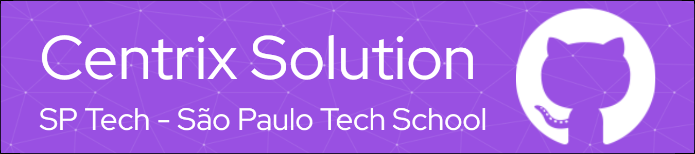

## Introdução
Bem-vindo ao nosso projeto colaborativo de criação de um Painel de Monitoramento projetado para facilitar o gerenciamento e monitoramento de computadores em um ambiente específico. Este projeto consiste em dois componentes principais: o documento HTML que define a estrutura do painel e o código JavaScript associado para implementar funcionalidades dinâmicas.

## Visão Geral
Nosso painel serve como uma ferramenta abrangente para supervisionar o status, posições e alertas relacionados a computadores distribuídos em diferentes andares de uma instalação. Ele fornece uma interface amigável para visualizar dados em tempo real e interagir eficientemente com o sistema.

## Funcionalidades
- **Monitoramento em Tempo Real:** Acompanhe o status dos computadores em tempo real, com indicadores visuais de ativos, inativos e alertas.
- **Mapa Interativo:** Visualize a disposição dos computadores em um mapa interativo do andar, facilitando a identificação e seleção.
- **Cadastro de Andares:** Adicione novos andares e associe-os ao ambiente de trabalho, permitindo uma configuração flexível e personalizada.
- **Salvamento de Posição:** Mantenha o controle da posição física dos computadores no ambiente e ajuste conforme necessário.
- **Dashboard Dinâmico:** Controle e visualize dados cruciais em tempo real.
- **Gerenciamento Detalhado:** Monitore operadores, andares e computadores com facilidade.
- **Gráficos Estatísticos:** Obtenha insights visuais sobre o desempenho de CPU e RAM.
- **Notificações Proativas:** Receba alertas em tempo real para uma resposta rápida.
- **Configuração Flexível:** Personalize andares e máquinas conforme necessário.
- **Integração de Rede:** Acesse dados de velocidade e latência da rede.
- **Compatibilidade Universal:** Use em diversos dispositivos para gestão eficiente.

## Tecnologias Utilizadas

<link rel="stylesheet" href="https://cdn.jsdelivr.net/gh/devicons/devicon@v2.15.1/devicon.min.css">
                               
        

## Instalação

1. Clone o repositório para sua máquina local:

   ```bash
   git clone https://github.com/Centrix-Solutions-Grupo-07/Ambiente_Teste.git
   ```

2. Abra o arquivo `index.html` em um navegador web.

## Como Contribuir

Se deseja contribuir para este projeto, siga as etapas abaixo:

1. Faça um fork do repositório.
2. Crie uma branch para sua contribuição:

   ```bash
   git checkout -b feature/sua-contribuicao
   ```

3. Realize suas alterações e faça commit:

   ```bash
   git commit -m "Adiciona funcionalidade/sua-contribuicao"
   ```

4. Faça push para a branch:

   ```bash
   git push origin feature/sua-contribuicao
   ```

5. Abra um pull request na página do repositório.

## Licença

Este projeto é distribuído sob a [Licença MIT](LICENSE).

## Contato

Se você tiver alguma dúvida, sugestão ou apenas quiser dizer olá, sinta-se à vontade para entrar em contato conosco.

- Suporte: support@centrix-solution.atlassian.net

Estamos ansiosos para ouvir de você!
